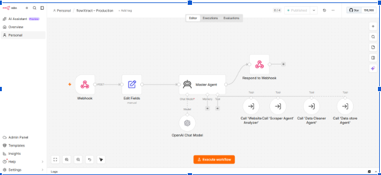
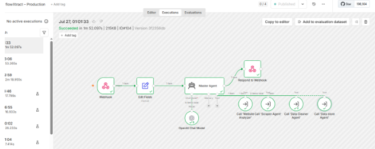

# flowXtract

An AI-powered multi-agent platform that extracts publicly available website data, cleans and structures it, stores the results in Google Sheets, and delivers them to users via email using n8n and OpenAI.

---

# Problem It Solves

Collecting structured data from websites manually is time-consuming, repetitive, and often requires technical web scraping expertise. 
flowXtract automates this entire process through an AI-powered multi-agent workflow.
Users simply provide::

- A website URL
- The data they want to extract
- Their email address

The system automatically analyzes the website, extracts the requested publicly available data, cleans and structures it, stores it in Google Sheets, and emails the final results.

## Error Handling

- If a user submits a homepage, incorrect URL, or a page that does not contain the requested products or records, flowXtract automatically sends an email explaining the       likely issue and guides the user to submit a direct listing, category, search, jobs, property, or article page.

- If the submitted page is correct but the website blocks automated extraction through CAPTCHA, anti-bot protection, login requirements, or restricted access, flowXtract       also informs the user by email and explains that the website may be preventing access to the requested data.
  
- No empty Google Sheet is created when extractable data is not found.

## Data Extraction Behavior

flowXtract extracts all publicly accessible records available on the submitted webpage at the time of extraction. The total number of extracted records may vary depending on the website structure, pagination, dynamic content loading, CAPTCHA, anti-bot protection, and other access restrictions imposed by the target website.
### Target Users

- Researchers
- Businesses
- Freelancers
- Sales & Marketing Teams
- E-commerce Professionals
- Real Estate Professionals
- Students & Developers

---

## Live Demo

🔗 [**Live Demo**](https://flowxtract-landing-page-build.vercel.app)

---

# Features

- AI-powered multi-agent workflow
- Automatic website analysis
- Supports both static and dynamic websites
- Intelligent extraction strategy selection
- Browserless support for JavaScript-rendered websites
- Custom data extraction based on user requirements
- Automatic data cleaning and validation
- Dynamic Google Sheets generation
- Email delivery with Google Sheet link and Excel attachment
- End-to-end workflow automation
- Simple and user-friendly interface
- Automatic email-based error notifications
- Intelligent validation of user requests

---
# Multi-Agent Architecture

flowXtract is built using a modular multi-agent architecture coordinated by a central Master Agent.

### Master Agent
- Validates user requests
- Orchestrates the complete workflow
- Coordinates all AI agents
- Handles workflow routing and error handling

### Website Analyzer Agent
- Detects website category
- Identifies rendering type
- Recommends the appropriate extraction strategy

### Scraper Agent
- Extracts publicly available website data
- Supports both static and Browserless-powered dynamic extraction

### Data Cleaner Agent
- Removes duplicates
- Cleans and standardizes extracted data
- Validates output

### Data Store Agent
- Creates Google Sheets automatically
- Stores cleaned data
- Sends email with Google Sheet link and Excel attachment

The AI agents are powered using **OpenAI GPT-4.1 Mini** and orchestrated through **n8n AI Agent workflows**.

---

# Tech Stack

- n8n
- OpenAI GPT-4.1 Mini
- JavaScript
- Browserless
- Google Sheets
- Gmail
- Lovable
- Vercel
- GitHub
- n8n Cloud
---

# Screenshots

## Landing Page


---

## Data Extraction Form


---

## n8n Multi-Agent Workflow



---

## Successful Workflow Execution



---
## Generated Google Sheet


---

## Email Delivery


---

# How to Run

1. Open the live application.
2. Enter a public website URL.
3. Describe the data you want to extract.
4. Enter your email address.
5. Click **Start Extraction**.
6. The backend automatically:
   - Analyzes the website
   - Selects the extraction strategy
   - Extracts the requested data
   - Cleans the results
   - Creates a Google Sheet
   - Sends the final results via email

---

## Run Locally

### Prerequisites

Before starting, make sure the following are installed:

- Git
- Node.js 18 or later
- npm

### Frontend Setup

Clone the repository:

```bash
git clone https://github.com/Tabinda-Fatima/flowXtract-ai.git
```

Move into the project directory:

```bash
cd flowXtract-ai
```

Install the required dependencies:

```bash
npm install
```

Start the development server:

```bash
npm run dev
```

Open the local URL displayed in the terminal, usually:

```text
http://localhost:5173
```

---
### Important Note


These steps run the frontend locally. The complete AI-powered extraction functionality depends on the configured n8n backend and connected services, including OpenAI, Browserless, Google Sheets, and Gmail.
For the complete working experience, use the [deployed Live Demo](https://flowxtract-landing-page-build.vercel.app).

---
# Supported Test Websites

 These example pages were successfully tested during development and can be used to evaluate the application.

### 📚 Books to Scrape

🔗 [Open Books to Scrape](https://books.toscrape.com/)

**Example Request:**  
Extract book titles, prices, availability, ratings, product links, and image URLs.

---

### 🏠 Zameen Property Listings

🔗 [Open Zameen Karachi Listings](https://www.zameen.com/Homes/Karachi-2-1.html)

**Example Request:**  
Extract property titles, prices, locations, areas, bedrooms, bathrooms, property types, listing links, and image URLs.

---

### 🛍️ Daraz Product Search

🔗 [Open Daraz Body Wash Search](https://www.daraz.pk/catalog/?q=body%20wash)

**Example Request:**  
Extract product names, prices, ratings, seller names, availability, and product links.


---

# 👩‍💻 Author

**Tabinda Fatima**

AI Automation & Workflow Developer
