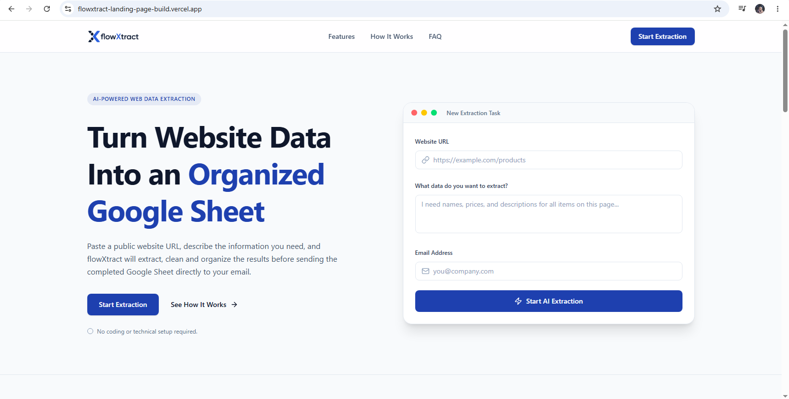
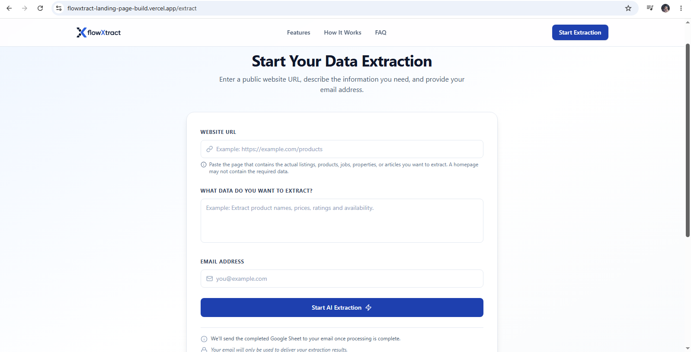
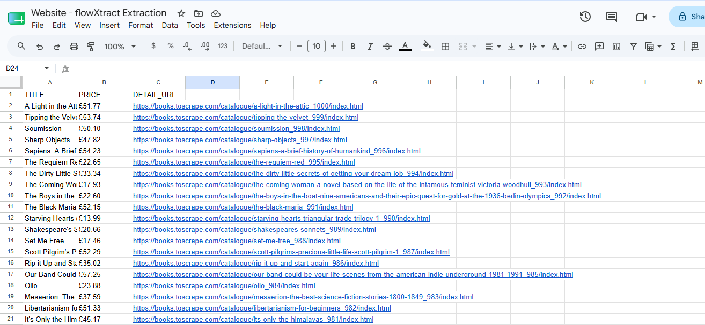
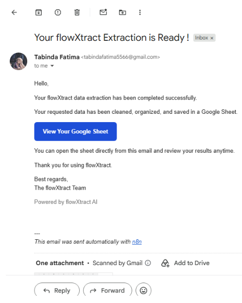

# flowXtract

**Turn any public website into a structured, business-ready dataset — no manual extraction scripts, no manual data entry.**

flowXtract is an AI-powered data extraction platform built for teams who need clean, structured information from the web without the overhead of building and maintaining custom web data extraction infrastructure. Submit a website URL, describe what you need, and receive a structured dataset delivered directly to your inbox.

🔗 **Live Demo:** https://flowxtract-landing-page-build.vercel.app

---

## Business Problem

Teams across sales, marketing, research, and operations regularly need structured data from websites — competitor pricing, product catalogs, job listings, business directories, real estate data — but getting it usually means one of two things:

- Manually copying and organizing information page by page, or
- Relying on developers to build and maintain custom data extraction scripts that break every time a website changes.

Both approaches are slow, expensive to sustain, and pull skilled people away from higher-value work.

## Solution

flowXtract removes that overhead. Instead of writing extraction logic or hiring technical resources, users simply describe what data they need in plain language. The platform handles the analysis, extraction, and structuring automatically, and delivers a finished dataset ready for immediate use.

No coding. No extraction workflow to configure. No manual cleanup.

---

## How flowXtract Works

flowXtract processes each request through a series of visible stages:
1. **Request Received** — URL, data requirements, and email are submitted
2. **Website Analysis** — the target page is assessed for structure and accessibility
3. **Extraction Strategy Selection** — the right approach is chosen for the specific site and request
4. **Data Extraction** — publicly available information is collected
5. **Data Cleaning & Validation** — extracted data is checked, standardized, and structured
6. **Structured Output Generation** — a clean, business-ready dataset is assembled
7. **Google Sheet Creation** — results are compiled into a shareable spreadsheet
8. **Email Delivery** — the final dataset is sent directly to the user

---

## AI Architecture

flowXtract is built on an **Agentic AI Architecture**, using **Multi-Agent Orchestration** rather than a single general-purpose model. An **Agentic Orchestrator** coordinates a set of **Specialized Sub-Agents**, each responsible for a distinct part of the extraction process:

- **Website Analyzer Agent** — evaluates page structure, accessibility, and content type
- **Extraction Agent** — determines the most effective extraction approach for the request
- **Data Intelligence Agent** — validates, cleans, and standardizes extracted information
- **Output Generation Agent** — assembles the final dataset and manages delivery

These agents are powered by **Intelligent Language Models** working in coordination, allowing flowXtract to adapt its approach to each website and request rather than relying on rigid, pre-defined rules.

---

## Core Features

- Agentic AI Architecture with Multi-Agent Orchestration
- Natural-language data extraction requests
- Intelligent website analysis and adaptive extraction strategy selection
- Public web data extraction across a range of site types
- Automated data cleaning and validation
- Dynamic structured output generation
- Google Sheets generation
- Excel export
- Automated email delivery
- Built-in error handling for failed or restricted extractions

---

## Error Handling

flowXtract is designed to fail transparently rather than silently. Users are automatically informed when:

- An unsupported or incorrect page is submitted
- The requested public data is unavailable
- The target page requires login access
- CAPTCHA or anti-bot protections block extraction
- Website restrictions prevent automated access

No empty or misleading output is generated when extraction cannot be completed — users are told clearly what happened and why.

---

## Business Use Cases

- Sales prospecting and lead list building
- Competitor research and pricing intelligence
- Product and catalog intelligence
- Market research
- Real estate listings
- Job listings aggregation
- Business directory compilation
- Research data collection

---

## Target Customers

- Small and mid-sized businesses
- Sales teams
- Marketing teams
- Agencies
- E-commerce businesses
- Real estate companies
- Researchers and analysts
- Business analysts

---

## Current Input Formats

- Website URL
- Extraction instructions (plain language)
- Email address

### Planned Input Formats

- PDF
- CSV
- Excel
- Plain text

---

## Current Output Formats

- Google Sheets
- Excel

### Planned Output Formats

- CSV
- JSON
- API access
- Webhooks

**Document Intelligence** for structured processing of uploaded documents is planned for a future release.

---

## Why flowXtract

- Describe what you need in plain language — no technical setup required
- Adapts its extraction approach per website rather than using fixed templates
- Validates and structures data automatically before delivery
- Delivers results in formats teams already use (Sheets, Excel)
- Communicates clearly when data isn't available, instead of failing silently
- Built specifically for business use cases, not general-purpose web data extraction

---

## Product Screenshots

---

## Responsible Use

flowXtract is designed to extract publicly available information only. It does not bypass login systems, CAPTCHA, or other access controls, and it respects website restrictions that prevent automated access. Users are responsible for ensuring their extraction requests comply with the terms of use of the websites they submit.

---

## Product Status

flowXtract is a live B2B SaaS MVP, currently evolving through real-world testing, customer feedback, and ongoing market research.

Currently supports website-based data extraction, with additional input and output formats planned for future releases.

---

## Founder

**Tabinda Fatima**  
AI Automation & Agentic AI Developer
